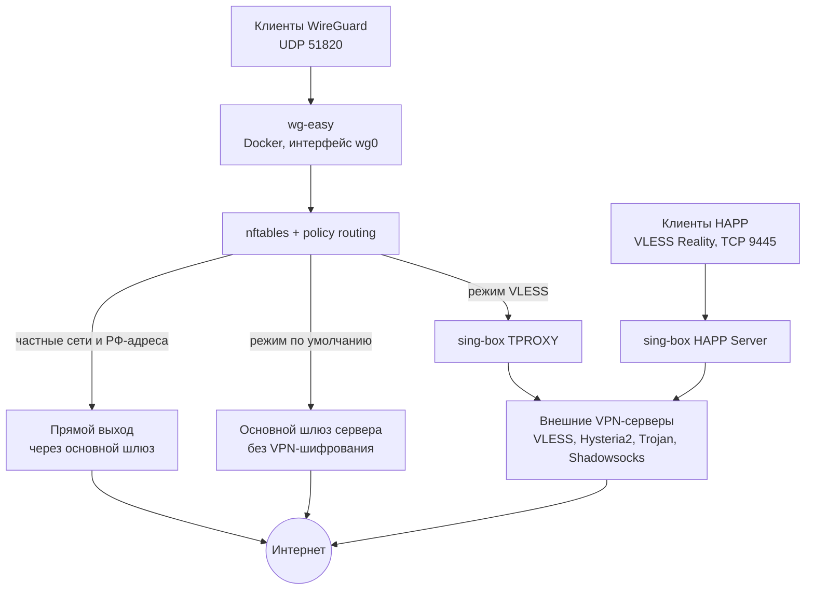
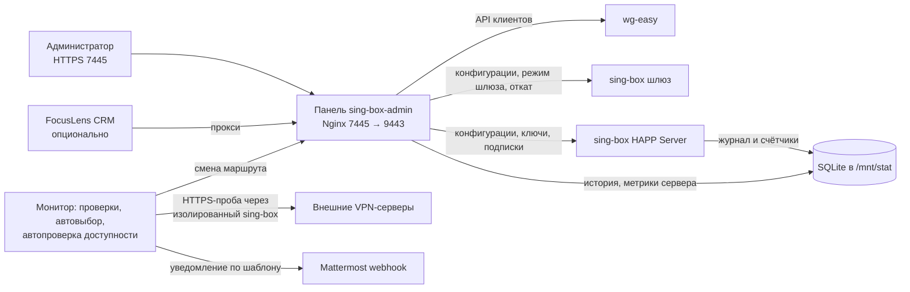

# FocusVPN v2.1.9

Единый VPN-шлюз и административная панель для WireGuard-сервера, sing-box и HAPP: управление клиентами WireGuard, серверами VLESS/Hysteria2/Trojan/Shadowsocks, HAPP-аккаунтами и подписками, статистикой, проверками доступности и уведомлениями Mattermost. Текущая версия — `2.1.9`; сервер `wg-easy` и его пользователи сохраняются. Предыдущие опубликованные теги и релизы не изменяются. Базовый релиз `v1.0` закреплён коммитом `3f48b16`, история Git не переписывается.

**Изменения v2.1.9:** [полный список в CHANGELOG](docs/CHANGELOG.md#v219---2026-10-10) · [сравнение v2.1.8…v2.1.9 на GitHub](https://github.com/DgekStr/FocusVPN/compare/v2.1.8...v2.1.9) · [GitHub Release v2.1.9](https://github.com/DgekStr/FocusVPN/releases/tag/v2.1.9)

## v2.1.9 - 2026-10-10

- **Внешний WireGuard-клиент удалён.** Убраны блок в Настройках, редактор конфигурации, connect/disconnect, status endpoint, polling, привилегированный status-helper, внешний peer routing/NAT и переключение HAPP на этот туннель. Шлюз поддерживает только VLESS и обычный шлюз сервера; HAPP сохраняет собственный provider outbound. WireGuard-сервер `wg-easy`, его клиенты и LAN-политики сохранены. Установщик не восстанавливает удалённый клиент: legacy-конфигурации архивируются только после подтверждения, данные managed `wg-easy` сохраняются.
- **Автопроверка доступности шлюза** (Настройки → «Автопроверка VLESS», выключена по умолчанию). Проверяется шлюз по умолчанию любого типа; после трёх подряд неудачных проверок (повтор каждую минуту) монитор переключает его на самый быстрый по пингу рабочий сервер через общую транзакцию gateway/HAPP с откатом и отправляет уведомление в Mattermost. Одиночный сбой шлюз не переключает: пробы на рабочем шлюзе бывают кратковременно неудачными, а переключение перезапускает sing-box и HAPP.
- **Сообщение Mattermost редактируется в Настройках:** шаблон с подстановками `{date}`, `{time}`, `{old}`, `{new}`, `{source}`, `{latency}` и смещением времени от UTC (по умолчанию `+03:00`). Текст по умолчанию состоит из пяти строк: заголовок «📢 VPN-шлюз: обновление статуса», дата и время смены («📅 ДД.ММ.ГГГГ | 🕐 ЧЧ:ММ»), «🔁 Произошла смена шлюза», «➡️ Было: …» и «✅ Стало: … (источник)»; пустое поле возвращает этот текст, неизвестные `{имена}` отклоняются.
- **Обзор сервера в Настройках:** добавлена карточка «SSD-диск» с объёмом «всего / занято» в ГБ, все пять карточек помещаются в одну строку. Время работы берётся из LXC-контейнера, а не физического хоста: unit панели должен содержать `BindReadOnlyPaths=/proc/uptime` (в репозитории он есть; на тестовом сервере строка отсутствовала и была добавлена).
- **Сброс статистики HAPP** очищает не только накопительный итог, но и записи «Истории HAPP» и данные скоростей выбранного пользователя; накопленные байты активных соединений не возвращаются после сброса. Блок «Доступ к панели» (смена пароля) перенесён под VIP-ссылку HAPP.
- `VERSION` и cache-bust CSS/JS: `2.1.9`. Прошли 210 Python-тестов и оба JS UI набора. Тег и [GitHub Release v2.1.9](https://github.com/DgekStr/FocusVPN/releases/tag/v2.1.9) опубликованы; команды установки и проверки клона ниже используют этот тег.

## Релизы

Подробные описания изменений и инструкции конкретных версий — в GitHub Releases и в [`docs/CHANGELOG.md`](docs/CHANGELOG.md):

- [v2.1.9 — текущий релиз](https://github.com/DgekStr/FocusVPN/releases/tag/v2.1.9) · [изменения](docs/CHANGELOG.md#v219---2026-10-10) · [сравнение с v2.1.8](https://github.com/DgekStr/FocusVPN/compare/v2.1.8...v2.1.9)
- [v2.1.8](https://github.com/DgekStr/FocusVPN/releases/tag/v2.1.8)
- [v2.1.7](https://github.com/DgekStr/FocusVPN/releases/tag/v2.1.7)
- [v2.1.6](https://github.com/DgekStr/FocusVPN/releases/tag/v2.1.6)
- [v2.1.5](https://github.com/DgekStr/FocusVPN/releases/tag/v2.1.5)
- [v2.1.4](https://github.com/DgekStr/FocusVPN/releases/tag/v2.1.4)
- [v2.1.3](https://github.com/DgekStr/FocusVPN/releases/tag/v2.1.3)
- [v2.1.2](https://github.com/DgekStr/FocusVPN/releases/tag/v2.1.2)
- [v2.1.1](https://github.com/DgekStr/FocusVPN/releases/tag/v2.1.1)
- [v2.1](https://github.com/DgekStr/FocusVPN/releases/tag/v2.1)
- [v2.0](https://github.com/DgekStr/FocusVPN/releases/tag/v2.0)
- [v1.0 — базовая публикация](https://github.com/DgekStr/FocusVPN/releases/tag/v1.0)

## Возможности

- VLESS Reality и `urltest`, ручной выбор исходящего маршрута, TPROXY только для клиентов WireGuard, прямой маршрут для частных сетей и обновляемого списка российских IPv4-адресов.
- Режимы шлюза: VLESS/TPROXY или обычный маршрут сервера по умолчанию. Перед переключением маршрута по умолчанию проверяются маршрут, переадресация IPv4 и правила FORWARD/NAT; индивидуальные запреты доступа к локальной сети сохраняются.
- Управление клиентами WireGuard: создание, включение, удаление, конфигурация, QR-код, активность и запрет LAN для отдельного клиента.
- Импорт sing-box/Xray JSON и массивов: VLESS, Hysteria2, Trojan и Shadowsocks. XHTTP и WireGuard outbound автоматически не преобразуются.
- Последовательные фоновые проверки VLESS с задержкой, состоянием очереди и временем проверки. Автовыбор выключен по умолчанию и переключает маршрут только после трёх последовательных побед одного профиля. Отдельная автопроверка доступности (выключена по умолчанию) переключает недоступный шлюз по умолчанию на самый быстрый рабочий сервер после трёх подряд неудачных проверок (повтор раз в минуту); текст уведомления Mattermost редактируется в Настройках.
- HAPP Server на VLESS Reality `9445`, персональные пользователи, отдельные UUID/QR, срок действия, включение/отзыв доступа и сохранение общей VIP-ссылки.
- Персональные HTTP-подписки с секретным токеном, изоляцией по учётной записи, безлимитным `total=0`, сроком действия и обновлением по запросу с часовым интервалом.
- Обзор сервера в Настройках: IP и ОС, время работы, SSD-диск (всего / занято), пики CPU и LAN за 24 часа и сетевые счётчики; история метрик хранится в приватной SQLite базе `/mnt/stat/server-metrics.sqlite3`.
- Клиентский профиль маршрутизации HAPP с 201 доменным исключением, сохраняющий существующие UUID и подписки.
- Журнал HAPP в приватной SQLite базе `/mnt/stat/happ-stat.sqlite3`: фоновые наблюдения, фильтры, пагинация и экспорт XLS. Подробная история очищается по сроку из Settings, по умолчанию через 60 дней.
- Интеграционный шлюз CRM к существующей панели с проверкой роли и источника запроса. Отдельный VPN-сервер для этой интеграции не устанавливается.
- Автономный установщик из Git устанавливает системные зависимости, панель и службы systemd, проверяет SHA-256 sing-box и безопасно запрашивает пароль панели.
- Перед установкой показывает пакеты и службы и запрашивает подтверждение. Автоматически запускает Nginx и контейнер wg-easy; setup wg-easy закрыт извне и доступен через SSH-туннель. При старых WireGuard-конфигах предлагает отмену или перенос в резервную копию.
- После установки печатает состав установленных компонентов и HTTPS-адрес панели `https://<IP>:7445`; для сертификата по IP используется самоподписанный сертификат.

## HAPP: точность статистики

Для сопоставления имени пользователя с активным соединением используется журнал аутентификации VLESS, а не только IP-адрес. Накопительные итоги учитывают только новые приросты счётчиков соединений и сохраняются после очистки подробной истории. При первом запуске они заполняются по записям, которые ещё есть в SQLite; данные, уже удалённые по сроку хранения, восстановить нельзя. Кнопка сброса очищает у выбранного профиля накопительный итог, записи «Истории HAPP» и данные скоростей; текущие значения счётчиков активных соединений становятся начальной точкой, после сброса учитываются лишь новые байты. Другие профили не затрагиваются.

В пользовательских списках, графиках и итогах отображаются только подтверждённые журналом учётные записи реестра и защищённая группа VIP. Наблюдения без установленного имени хранятся приватно для позднего сопоставления и не создают пользователя «Не определён». Для закрытого соединения поздняя аутентификация учитывается только при уникальном совпадении IP, порта, назначения и времени; накопленные байты переносятся один раз. Доступ VLESS требует зарегистрированного UUID, отсутствие имени в наблюдении не означает анонимную авторизацию.

Исторический график и накопительные итоги — наблюдаемые оценки, а не точные данные для расчётов. При разрыве или перезапуске соединения могут потеряться последние байты, которые сборщик не успел зафиксировать. Полные HTTPS-адреса страниц и их содержимое недоступны.

Удаление персонального пользователя из HAPP Server удаляет его данные из четырёх таблиц статистики, включая историю и накопительные итоги. После обновления такая очистка применяется и к ранее удалённым профилям; перед обновлением сделайте резервную копию SQLite. Отмена неуспешного применения VPN-конфигурации не удаляет статистику. Отключение или истечение срока не равны удалению: данные зарегистрированного профиля сохраняются. Административный журнал действий сохраняет запись об удалении.

## Адреса

| Назначение | Адрес |
|---|---|
| Административная панель после установки | `https://<IP-адрес-сервера>:7445` |
| VPN-серверы | `/outbounds` |
| WireGuard | `/wireguard` |
| HAPP Server | `/happ-server` |
| Настройки | `/settings` |
| Журнал переключений | `/gateway-journal` |
| История HAPP | `/happ-history` |
| Информация о подписке | `/happ-info` |
| HAPP VLESS inbound | публичный адрес, TCP `9445` |

IP-адрес панели определяется установщиком по основному маршруту сервера; HTTPS доступен на порту `7445`. Для IP используется самоподписанный сертификат, поэтому браузер покажет предупреждение. Backend панели слушает только `127.0.0.1:9443` за Nginx и не должен публиковаться напрямую. Для постоянного домена настройте DNS и сертификат доверенного центра отдельно.

Подписки HAPP по умолчанию используют тот же внешний HTTPS-порт `7445`, а не закрытый backend `9443`. Сохранённые ссылки со старым портом нужно заново скопировать из панели и импортировать в клиент; токены и VPN-ключи не меняются. Клиент должен доверять сертификату HTTPS. Другой публичный адрес подписок можно явно задать в Настройках.

Установщик сохраняет `FOCUSVPN_HAPP_SUBSCRIPTION_BASE_URL=https://<IP-адрес-сервера>:7445` в `/etc/focusvpn/focusvpn.env`, если значение отсутствует или пустое. Уже настроенный непустой адрес подписок сохраняется без изменений.

В разделе «Настройки» можно изменить заголовок сервера HAPP и текст объявления, которые приходят вместе с подпиской. Заголовок отображается перед именем пользователя, а после объявления автоматически добавляются реальные счётчики `DL` и `UL` с текущими объёмами скачивания и отправки. Изменения используются при следующем обновлении подписки в HAPP; перезапускать VPN-сервисы не нужно.

## Установка

Для воспроизводимой установки релиза `v2.1.9` на Debian 12+ или Ubuntu 22.04+:

```bash
curl -fsSL https://raw.githubusercontent.com/DgekStr/FocusVPN/v2.1.9/scripts/bootstrap.sh | sudo bash -s -- v2.1.9
```

Для установки текущей ветки разработки используйте `master`:

```bash
curl -fsSL https://raw.githubusercontent.com/DgekStr/FocusVPN/master/scripts/bootstrap.sh | sudo bash -s -- master
```

Bootstrap клонирует выбранную ветку или тег во временный каталог с правами `0700`, запускает `scripts/install.sh` и удаляет копию после завершения. Для интерактивного ввода пароля требуется терминал. Пароль не передаётся в аргументах командной строки или переменных окружения; в `/etc/sing-box-admin/auth.json` сохраняется хеш scrypt с солью и правами `0600`.

Если установка прервалась с `could not determine the server IPv4 address for the panel URL`, повторите команду для `master` после получения исправления. Не удаляйте `/etc/sing-box-admin/auth.json`: существующие учётные данные и файлы конфигурации сохраняются. Адрес панели теперь определяется через `ip -4 route get 1.1.1.1`, поскольку обычный маршрут по умолчанию может не содержать поле `src`; эта команда только запрашивает маршрут у ядра и не отправляет сетевые пакеты.

Дополнительные параметры:

- wg-easy запускается и настраивается автоматически, служебные учётные данные подключаются к API панели. Прямой доступ к порту `51821` извне закрыт.
- `--enable` проверяет реальные конфигурации и включает VPN-службы. Не используйте этот параметр до заполнения конфигураций шлюза, HAPP и wg-easy.

Установка актуальных дополнений из клонированного репозитория:

```bash
git clone --branch master https://github.com/DgekStr/FocusVPN.git
cd FocusVPN
sudo ./scripts/install.sh
```

Для обновления существующего клона `master` сначала получите изменения через `git pull --ff-only`, затем запускайте установщик после резервного копирования и в согласованное окно обслуживания. Это полноценная установка с apt/Docker/Nginx, а не бесшовный deploy одного UI-файла. Не запускайте `--enable`, если VPN-конфигурации не заполнены. Секретный ключ HTTP-подписок и пользовательские данные должны сохраняться на сервере, а не восстанавливаться из шаблонов Git.

Затем настройте `/etc/focusvpn/focusvpn.env`, заполните реальные файлы `/etc/sing-box/config.json`, `/etc/sing-box-happ-server/config.json` и `/etc/sing-box-admin/happ-server.json` и только после этого выполните `sudo ./scripts/install.sh --enable`. Файл `/etc/sing-box-admin/wg-easy-api.json` уже настроен установщиком. Автоматически выбранный IP для WireGuard является адресом сервера, а не гарантированным публичным адресом за NAT: для удалённых клиентов проверьте адрес и проброс UDP `51820`. Остальные VPN-службы с шаблонными конфигурациями не включаются.

## Проверка клона Git

Проверка опубликованного тега из PowerShell без установки с правами администратора:

```powershell
$clone = Join-Path $env:TEMP ('FocusVPN-v2.1.9-' + [guid]::NewGuid().ToString('N'))
git clone --depth 1 --branch v2.1.9 https://github.com/DgekStr/FocusVPN.git $clone
Push-Location $clone
try {
    .\scripts\validate.ps1
    py -3 -m unittest discover -s scripts -p 'test_*.py' -q
    node scripts\test_panel_checks.js
    node scripts\test_happ_stats_ui.js
    & 'C:\Program Files\Git\bin\bash.exe' scripts/bootstrap.sh --help
    & 'C:\Program Files\Git\bin\bash.exe' scripts/install.sh --help
} finally {
    Pop-Location
}
```

В Linux вместо `C:\Program Files\Git\bin\bash.exe` используйте `bash`. Текущий набор содержит тесты Python, два набора проверок интерфейса на Node.js и publication checks. Проверки включают удаление и защиту статистики от поздних замеров, 25-сегментные индикаторы, редактор, HAPP-мастер/ключи, исключения подписки, preflight и копирование runtime установщиком, сохранение рабочих данных. Для проверки ветки разработки клонируйте `master` вместо тега `v2.1.9`.

## Репозиторий

- `server/panel/` — код панели на Python и обработчики HAPP/WireGuard.
- `server/panel/static/` — CSS и JavaScript.
- `server/libexec/` и `server/systemd/` — системные команды и службы.
- `server/config/` — безопасные шаблоны конфигураций.
- `scripts/` — установщик, bootstrap, тесты и средство предварительного просмотра.
- `docs/screenshots/` — обезличенные снимки интерфейса (см. раздел Screenshots).
- `docs/OPERATIONS.md` — эксплуатация и развертывание.
- `docs/PROJECT_STATUS.md` и `docs/ROADMAP.md` — статус и следующие задачи.
- `docs/CHANGELOG.md` — изменения v2.1.9 и более ранних релизов.
- `VERSION` — версия установленной системы.

Секреты, реальные UUID и VLESS-ссылки, ключи Reality, данные Basic Auth, секрет API wg-easy, рабочие базы и введённые администраторами конфигурации в Git не включаются.

## Screenshots

Скриншоты сняты с серверных renderer и обезличенных fixtures, не с реальных пользовательских данных. UI-снимки отражают v2.0 и не включают последние карточки обзора сервера, историю chart и новые блоки Настроек v2.1.9; они не подтверждают доступность VPN-профилей или импорт внутри Windows HAPP.


## Блок-схема работы VPN-сервиса

### Путь трафика



### Управление и мониторинг



- WireGuard-клиенты подключаются к `wg-easy`; их трафик маршрутизируется nftables/policy routing: частные сети и российские адреса идут напрямую, остальное — в зависимости от режима шлюза.
- Режим VLESS направляет остальной трафик через sing-box TPROXY к выбранному внешнему серверу. Режим «по умолчанию» отключает TPROXY и выпускает трафик подсети WireGuard через основной шлюз сервера; это не VPN-туннель.
- HAPP-клиенты подключаются к отдельному VLESS Reality входу (TCP `9445`) и используют тот же провайдерский маршрут; ссылки, QR и подписки выдаёт панель.
- Панель — единая точка управления. Изменения маршрута проходят общую транзакцию: проверка конфигураций, резервная копия, перезапуск sing-box и HAPP, откат при ошибке.
- Монитор проверяет серверы изолированным sing-box (HTTPS-задержка) и при включённых опциях выбирает быстрейший сервер или переключает недоступный шлюз и отправляет уведомление в Mattermost.