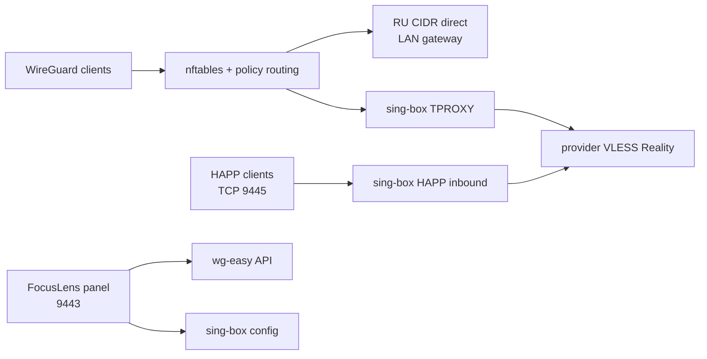

# FocusVPN

Единый VPN-шлюз и административная панель для WireGuard, sing-box и HAPP.

Состояние проекта зафиксировано: **2026-09-29**.

## Что готово

- sing-box 1.14.2 установлен на Ubuntu 22.04 LTS.
- Исходящий VLESS Reality с автоматическим выбором профилей и ручным selector в панели.
- TPROXY применяется только к клиентам WireGuard из `<wireguard-client-network>`.
- Российские IPv4 из агрегированного `ru.zone` обходят VLESS напрямую через LAN-маршрут.
- Частные сети и `<lan-network>` остаются direct.
- Добавлен ежедневный updater RU-сетей через systemd timer.
- WireGuard/wg-easy объединён с VLESS в одной FocusLens-панели и одной Basic Auth.
- Управление клиентами WireGuard: создание, включение, удаление, `.conf`, QR, live-активность и per-client запрет LAN.
- Отдельный HAPP-compatible VLESS Reality server на TCP `9445`.
- HAPP Server использует provider VLESS outbound, а не прямой выход.
- Единый shell главной VLESS-страницы для VLESS, WireGuard, HAPP Server и Settings.
- Settings управляет VLESS, WireGuard, HAPP Server и паролем панели; HAPP config проходит validation и rollback.
- Public-only HAPP `vless://` и QR-модальное окно.
- Панель WireGuard показывает пять статусных карточек: онлайн, всего, DL/UL, WAN IP и uptime сервиса.

## Endpoints

| Назначение | Адрес |
|---|---|
| Админ-панель | `http://<gateway-host>:9443` |
| WireGuard UI | `http://<gateway-host>:9443/wireguard` |
| HAPP Server | `http://<gateway-host>:9443/happ-server` |
| Настройки | `http://<gateway-host>:9443/settings` |
| HAPP VLESS inbound | `<public-ip-or-domain>:9445` |

Панель разрешена из `<wireguard-client-network>`, `<lan-network>` и `<management-network>`. Порт `9445` требует внешнего TCP-проброса на `<gateway-host>:9445`, если сервер находится за NAT.

## Установка

Оптимальный путь развёртывания - `git clone` и идемпотентный installer из этого репозитория. Он поддерживает Debian 12+ и Ubuntu 22.04+ на `amd64` и `arm64`, устанавливает sing-box `1.14.2`, Docker, systemd units, panel и безопасные templates. Runtime-секреты никогда не берутся из Git.

Перед началом подготовьте root-доступ, рабочий DNS/интернет на сервере и консольный доступ: после включения firewall панель и wg-easy UI будут ограничены заданными сетями.

1. Клонируйте репозиторий и запустите безопасную базовую установку. Она спросит пароль Basic Auth для панели, но не запустит сетевые сервисы.

    ```bash
    git clone https://github.com/DgekStr/FocusVPN.git
    cd FocusVPN
    sudo ./scripts/install.sh
    ```

2. Настройте сети и адреса панели в root-only env-файле.

    ```bash
    sudoedit /etc/focusvpn/focusvpn.env
    ```

    Укажите как минимум `FOCUSVPN_WG_INTERFACE`, `FOCUSVPN_WG_NETWORK`, `FOCUSVPN_LAN_NETWORK`, `FOCUSVPN_MANAGEMENT_NETWORK` и `FOCUSVPN_WG_FALLBACK_GATEWAY`. Значения по умолчанию соответствуют текущей тестовой схеме: `wg0`, `10.8.0.0/24`, `192.168.0.0/24`, `10.1.17.0/24`.

3. Заполните templates реальными значениями. Не оставляйте `<placeholder>` и не публикуйте эти файлы.

    ```text
    /etc/sing-box/config.json                    # Исходящие VLESS Reality профили
    /etc/sing-box-happ-server/config.json        # HAPP Reality inbound и provider outbound
    /etc/sing-box-admin/happ-server.json         # Публичная HAPP/VLESS ссылка и QR
    /etc/sing-box-admin/wg-easy-api.json         # Basic Auth служебного API wg-easy
    ```

    Примеры лежат в `server/config/`. Для `happ-server.json` public key, UUID и short ID должны соответствовать HAPP inbound. Для domain bypass в HAPP используйте route actions sing-box `1.14`: сначала `{ "action": "sniff" }`, затем правило `domain_suffix` с `action: "route"` и direct outbound.

4. Один раз создайте контейнер wg-easy и завершите initial setup через LAN-адрес сервера на порту `51821`.

    ```bash
    sudo ./scripts/install.sh --start-wg-easy
    sudoedit /etc/sing-box-admin/wg-easy-api.json
    ```

    После создания администратора wg-easy внесите его данные в `wg-easy-api.json`. Не открывайте порт `51821` в интернет: после следующего шага доступ к нему ограничит локальный firewall.

5. Проверьте конфигурации и включите сервисы. Installer откажется запускаться при placeholders, отсутствующем wg-easy или невалидной конфигурации.

    ```bash
    sudo ./scripts/install.sh --enable
    systemctl is-active sing-box sing-box-admin sing-box-happ-server wg-easy-private-ui
    ```

6. Откройте панель из разрешённой LAN, management или WireGuard сети: `http://<server-address>:9443`. Для внешнего HAPP откройте/пробросьте только TCP `9445`; для WireGuard нужен UDP `51820`.

### Обновление и проверка

```bash
cd FocusVPN
git pull --ff-only
sudo ./scripts/install.sh
sudo ./scripts/install.sh --enable

sing-box check -C /etc/sing-box
sing-box check -C /etc/sing-box-happ-server
nft --check -f /etc/sing-box/tproxy.nft
systemctl status sing-box sing-box-admin sing-box-happ-server --no-pager
```

Installer не перезаписывает существующие runtime-конфиги, `auth.json`, state и backups. Для отката кода используйте Git revision, повторно запустите installer и затем `--enable`; для конфигураций используйте backups из `/etc/sing-box-admin/backups/`.

## Архитектура



## Репозиторий

- `server/panel/` — актуальный код FocusLens-панели.
- `server/panel/static/` — общий CSS, SPA-router, HAPP actions и favicon.
- `server/libexec/` — firewall, policy-routing и zone update scripts.
- `server/systemd/` — units и drop-in для автозапуска.
- `server/config/` — безопасные правила и обезличенные `.example` конфиги.
- `docs/OPERATIONS.md` — эксплуатация и деплой.
- `docs/PROJECT_STATUS.md` — закрытые вехи и текущий статус.
- `docs/ROADMAP.md` — следующие этапы.
- `docs/screenshots/` — обезличенные preview UI.
- `index.html` — публикационная страница проекта.

## Screenshots


## Важно по секретам

Реальные UUID, Reality public/private keys, Basic Auth hash, wg-easy API secret, VLESS-ссылки и SQLite базы намеренно не включены в git. В `server/config/` лежат только шаблоны с placeholders. Перед deploy нужно создать secret-файлы отдельно на сервере.

