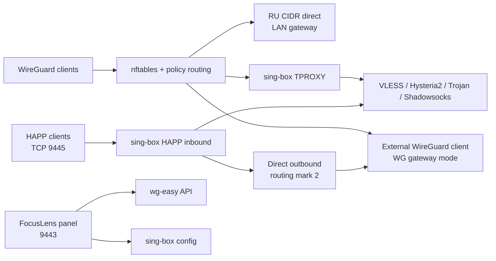

# FocusVPN

Единый VPN-шлюз и административная панель для WireGuard, sing-box и HAPP.

Состояние проекта зафиксировано: **2026-10-02**.

## Что готово

- sing-box 1.14.2 установлен на Ubuntu 22.04 LTS.
- Исходящий VLESS Reality с автоматическим выбором профилей и ручным selector в панели.
- TPROXY применяется только к клиентам WireGuard из `<wireguard-client-network>`.
- Российские IPv4 из агрегированного `ru.zone` обходят VLESS напрямую через LAN-маршрут.
- Частные сети и `<lan-network>` остаются direct.
- Добавлен ежедневный updater RU-сетей через systemd timer.
- WireGuard/wg-easy объединён с VLESS в одной FocusLens-панели и одной Basic Auth.
- Управление клиентами WireGuard: создание, включение, удаление, `.conf`, QR, live-активность и per-client запрет LAN.
- Отдельный HAPP-compatible VLESS Reality server на TCP `9445`.
- Gateway и HAPP синхронно используют выбранный серверный профиль; применение проверяет оба конфига и поддерживает совместный rollback.
- Основной раздел панели - VPN-серверы; отдельный пункт VLESS скрыт. WireGuard, HAPP Server, Settings и журнал используют общий shell.
- Settings управляет VLESS, WireGuard, HAPP Server и паролем панели; HAPP config проходит validation и rollback.
- Режим шлюза переключается между VLESS и внешним WireGuard-клиентом; при WireGuard VLESS/TProxy приостановлен, трафик VPN-клиентов идёт через туннель, LAN остаётся напрямую.
- VPN-серверы управляются в `/outbounds`: импорт sing-box/Xray VLESS, Hysteria2, Trojan и Shadowsocks JSON, включая массив конфигураций; замена профиля, удаление с синхронизацией `vless-auto` и выбор default route. XHTTP и WireGuard outbound не конвертируются: причина пропуска выводится отдельно.
- В Settings доступна последовательная автопроверка VLESS с интервалом 1-60 минут, сохранением задержки через туннель и красными статусами ошибок. Автовыбор переключает gateway/HAPP после трёх последовательных побед одного VLESS; ручные изменения сбрасывают серию, WireGuard mode не переключается автоматически.
- Журнал `/gateway-journal` фиксирует циклы и смену шлюза; уведомления Mattermost отправляются через сохранённый webhook в фоне. URL хранится приватно и не возвращается в интерфейс.
- Исходный WireGuard-конфиг сохраняется с правами `0600` и повторно заполняет поле в авторизованных Settings; рабочий профиль не меняет DNS хоста. Выбранный режим восстанавливается после перезагрузки.
- Public-only HAPP `vless://` и QR-модальное окно.
- Панель WireGuard показывает пять статусных карточек: онлайн, всего, DL/UL, WAN IP и uptime сервиса.

## Endpoints

| Назначение | Адрес |
|---|---|
| Админ-панель | `http://<gateway-host>:9443` |
| VPN-серверы | `http://<gateway-host>:9443/outbounds` |
| WireGuard UI | `http://<gateway-host>:9443/wireguard` |
| HAPP Server | `http://<gateway-host>:9443/happ-server` |
| Настройки | `http://<gateway-host>:9443/settings` |
| Журнал переключений | `http://<gateway-host>:9443/gateway-journal` |
| HAPP VLESS inbound | `<public-ip-or-domain>:9445` |

Панель разрешена из `<wireguard-client-network>`, `<lan-network>` и `<management-network>`. Порт `9445` требует внешнего TCP-проброса на `<gateway-host>:9445`, если сервер находится за NAT.

## Установка

Оптимальный путь развёртывания - `git clone` и идемпотентный installer из этого репозитория. Он поддерживает Debian 12+ и Ubuntu 22.04+ на `amd64` и `arm64`, устанавливает sing-box `1.14.2`, Docker, systemd units, panel и безопасные templates. Runtime-секреты никогда не берутся из Git.

Перед началом подготовьте root-доступ, рабочий DNS/интернет на сервере и консольный доступ: после включения firewall панель и wg-easy UI будут ограничены заданными сетями.

1. Клонируйте репозиторий и запустите безопасную базовую установку. Она спросит пароль Basic Auth для панели, но не запустит сетевые сервисы.

    ```bash
    git clone https://github.com/DgekStr/FocusVPN.git
    cd FocusVPN
    sudo ./scripts/install.sh
    ```

2. Настройте сети и адреса панели в root-only env-файле.

    ```bash
    sudoedit /etc/focusvpn/focusvpn.env
    ```

    Укажите как минимум `FOCUSVPN_WG_INTERFACE`, `FOCUSVPN_WG_NETWORK`, `FOCUSVPN_LAN_NETWORK`, `FOCUSVPN_MANAGEMENT_NETWORK` и `FOCUSVPN_WG_FALLBACK_GATEWAY`. Значения по умолчанию соответствуют текущей тестовой схеме: `wg0`, `10.8.0.0/24`, `192.168.0.0/24`, `10.1.17.0/24`.

3. Заполните templates реальными значениями. Не оставляйте `<placeholder>` и не публикуйте эти файлы.

    ```text
    /etc/sing-box/config.json                    # Исходящие VLESS Reality профили
    /etc/sing-box-happ-server/config.json        # HAPP Reality inbound и provider outbound
    /etc/sing-box-admin/happ-server.json         # Публичная HAPP/VLESS ссылка и QR
    /etc/sing-box-admin/wg-easy-api.json         # Basic Auth служебного API wg-easy
    ```

    Примеры лежат в `server/config/`. Для `happ-server.json` public key, UUID и short ID должны соответствовать HAPP inbound. Для domain bypass в HAPP используйте route actions sing-box `1.14`: сначала `{ "action": "sniff" }`, затем правило `domain_suffix` с `action: "route"` и direct outbound.

4. Один раз создайте контейнер wg-easy и завершите initial setup через LAN-адрес сервера на порту `51821`.

    ```bash
    sudo ./scripts/install.sh --start-wg-easy
    sudoedit /etc/sing-box-admin/wg-easy-api.json
    ```

    После создания администратора wg-easy внесите его данные в `wg-easy-api.json`. Не открывайте порт `51821` в интернет: после следующего шага доступ к нему ограничит локальный firewall.

5. Проверьте конфигурации и включите сервисы. Installer откажется запускаться при placeholders, отсутствующем wg-easy или невалидной конфигурации.

    ```bash
    sudo ./scripts/install.sh --enable
    systemctl is-active sing-box sing-box-admin sing-box-happ-server wg-easy-private-ui
    ```

6. Откройте панель из разрешённой LAN, management или WireGuard сети: `http://<server-address>:9443`. Для внешнего HAPP откройте/пробросьте только TCP `9445`; для WireGuard нужен UDP `51820`.

В Settings можно добавить клиентский конфиг внешнего WireGuard peer с `AllowedIPs = 0.0.0.0/0`, затем переключать режимы шлюза. Для переключения показывается предупреждение; LAN-подсеть исключается из внешнего туннеля. Приватный ключ сохраняется в `/etc/wireguard/wg-client.conf` с правами `0600`. Без сохранённого peer-конфига режим WireGuard недоступен.

### Обновление и проверка

```bash
cd FocusVPN
git pull --ff-only
sudo ./scripts/install.sh
sudo ./scripts/install.sh --enable

sing-box check -C /etc/sing-box
sing-box check -C /etc/sing-box-happ-server
nft --check -f /etc/sing-box/tproxy.nft
systemctl status sing-box sing-box-admin sing-box-happ-server --no-pager
```

Installer не перезаписывает существующие runtime-конфиги, `auth.json`, state и backups. Для отката кода используйте Git revision, повторно запустите installer и затем `--enable`; для конфигураций используйте backups из `/etc/sing-box-admin/backups/`.

## Архитектура



## Импорт и проверки

В VPN-серверы можно вставить один outbound, полный sing-box/Xray config или массив до 16 конфигураций. Для массива выбирайте добавление новых `auto-N` и оставляйте общий tag пустым. Поддерживаются VLESS TCP/gRPC, Hysteria2, Trojan TLS и Shadowsocks; XHTTP не заменяется другим транспортом, а WireGuard настраивается отдельно в Settings. Причины пропуска элементов отображаются явно.

Импорт проверяет конфигурацию, синхронизирует gateway/HAPP и `vless-auto`, не меняя выбранный маршрут. HTTPS-тесты идут последовательно в фоне. В таблице видны очередь, результат, внешний IP, задержка и время проверки; стартовое уведомление заменяется фактическим результатом, а polling имеет таймаут и повторные попытки. Неуспешный тест означает сохранённый, но не подтверждённый рабочим профиль, а не зависшую очередь.

Автопроверка и автовыбор по умолчанию выключены; интервал - 5 минут, допустимый диапазон 1-60 минут между полными циклами. Измеряется время до первого HTTPS-байта через туннель, не ICMP. Автовыбор рассматривает только VLESS и переключает маршрут после трёх полных циклов подряд с одним лидером. Ошибки, ручные изменения, редактирование профилей/настроек и перезапуск сбрасывают серию; в WireGuard mode автоматическое переключение запрещено.

Mattermost webhook вводится в Settings и хранится приватно. Доставка выполняется в фоне, ошибки фиксируются в журнале без отката маршрута. Реальная доставка требует настройки webhook; отдельная кнопка отправляет тестовое уведомление.

## Проверки разработки

```powershell
py -3 scripts/test_route_sync.py
py -3 scripts/test_vless_monitor.py
node scripts/test_panel_checks.js
.\scripts\validate.ps1
```

Тесты покрывают общий маршрут gateway/HAPP и rollback, пакетный импорт, неблокирующий POST, три последовательные победы VLESS, webhook и восстановление polling после сетевой ошибки. Конфигурационный check или статус `active` не заменяют успешный HTTPS-тест.

## Репозиторий

- `server/panel/` — актуальный код FocusLens-панели.
- `server/panel/static/` — общий CSS, SPA-router, HAPP actions и favicon.
- `server/libexec/` — firewall, policy-routing и zone update scripts.
- `server/systemd/` — units и drop-in для автозапуска.
- `server/config/` — безопасные правила и обезличенные `.example` конфиги.
- `docs/OPERATIONS.md` — эксплуатация и деплой.
- `docs/PROJECT_STATUS.md` — закрытые вехи и текущий статус.
- `docs/ROADMAP.md` — следующие этапы.
- `docs/screenshots/` — обезличенные preview UI.
- `index.html` — публикационная страница проекта.

## Screenshots


## Важно по секретам

Реальные UUID, Reality public/private keys, Basic Auth hash, wg-easy API secret, VLESS-ссылки и SQLite базы намеренно не включены в git. В `server/config/` лежат только шаблоны с placeholders. Перед deploy нужно создать secret-файлы отдельно на сервере.

