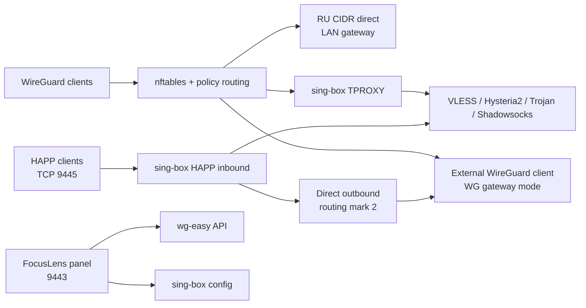
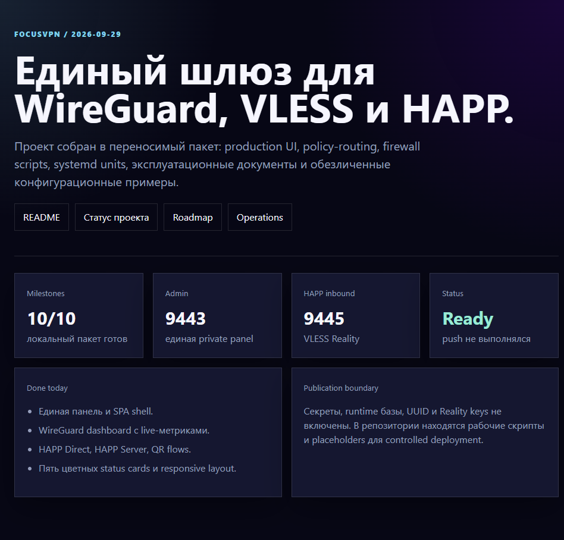
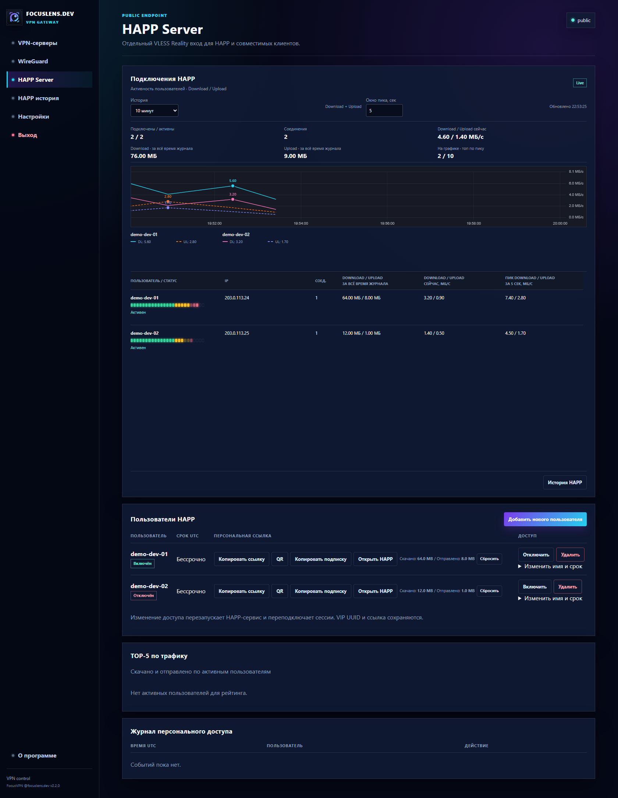
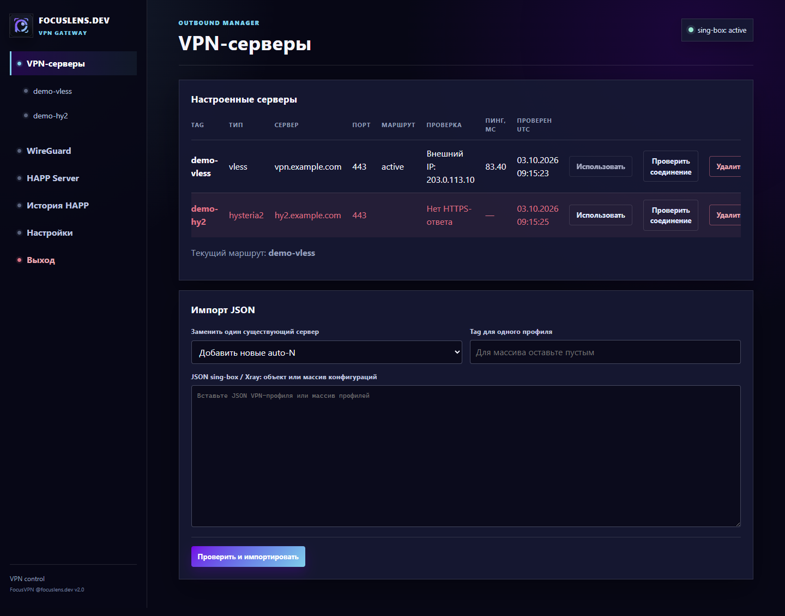
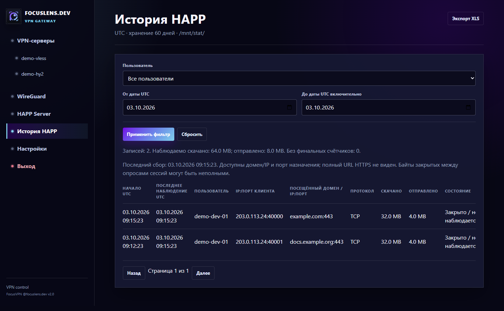
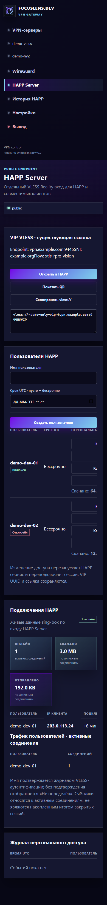

# FocusVPN v2.1

Единый VPN-шлюз и административная панель для WireGuard, sing-box и HAPP.

Состояние проекта зафиксировано: **2026-10-06**.

Текущая версия: **v2.1**. Базовая версия **v1.0** соответствует ранее опубликованному коммиту `3f48b16`; история Git не переписывается.

## Новое в v2.1

- В Settings добавлены локальные метрики VPN-хоста: LAN IP и ОС, uptime, пик CPU и LAN за rolling 24 часа, RX/TX с начала загрузки. Collector читает системные `/proc` counters раз в 5 секунд и сохраняет samples в `/mnt/stat/server-metrics.sqlite3`.
- `/happ-history` показывает per-client график download/upload с числовыми значениями, фильтрами периода и сортировкой по суммарному трафику.
- HAPP lifetime download/upload counters сохраняются отдельно от retention истории; есть TOP-5 и адресный сброс статистики профиля.
- Live HAPP connections агрегируются по IP и протоколу: длительность и байты суммируются, destination соответствует последнему соединению. VIP Endpoint берётся из настроенного публичного URL подписки.
- В Chrome/Chromium favicon панели анимируется Canvas-кадрами с пульсирующим зелёным индикатором.

## Что готово

- sing-box 1.14.2 установлен на Ubuntu 22.04 LTS.
- Исходящий VLESS Reality с автоматическим выбором профилей и ручным selector в панели.
- TPROXY применяется только к клиентам WireGuard из `<wireguard-client-network>`.
- Российские IPv4 из агрегированного `ru.zone` обходят VLESS напрямую через LAN-маршрут.
- Частные сети и `<lan-network>` остаются direct.
- Добавлен ежедневный updater RU-сетей через systemd timer.
- WireGuard/wg-easy объединён с VLESS в одной FocusLens-панели и одной Basic Auth.
- Управление клиентами WireGuard: создание, включение, удаление, `.conf`, QR, live-активность и per-client запрет LAN.
- Отдельный HAPP-compatible VLESS Reality server на TCP `9445`.
- Gateway и HAPP синхронно используют выбранный серверный профиль; применение проверяет оба конфига и поддерживает совместный rollback.
- Основной раздел панели - VPN-серверы; отдельный пункт VLESS скрыт. WireGuard, HAPP Server, Settings и журнал используют общий shell.
- Settings управляет VLESS, WireGuard, HAPP Server и паролем панели; HAPP config проходит validation и rollback.
- Установка доступна как из Git clone, так и отдельной исполняемой `scripts/bootstrap.sh`: при необходимости устанавливаются Git/пакеты/sing-box, запрашивается пароль панели и создаются все systemd units.
- Режим работы VPN-шлюза переключается между VLESS/TPROXY, прямым egress через основной default gateway сервера и внешним WireGuard-клиентом. Default mode не меняет системный маршрут сервера; перед включением проверяются route, IPv4 forwarding, существующие FORWARD/NAT правила, индивидуальные LAN-запреты сохраняются. Для WireGuard mode VLESS/TPROXY приостанавливается, трафик VPN-клиентов идёт через внешний туннель. HAPP inbound/outbound остаётся отдельным.
- VPN-серверы управляются в `/outbounds`: импорт sing-box/Xray VLESS, Hysteria2, Trojan и Shadowsocks JSON, включая массив конфигураций; замена профиля, удаление с синхронизацией `vless-auto` и выбор default route. XHTTP и WireGuard outbound не конвертируются: причина пропуска выводится отдельно.
- В Settings доступна последовательная автопроверка VLESS с интервалом 1-60 минут, сохранением задержки через туннель и красными статусами ошибок. Автовыбор переключает gateway/HAPP после трёх последовательных побед одного VLESS; ручные изменения сбрасывают серию, WireGuard mode не переключается автоматически.
- Журнал `/gateway-journal` фиксирует циклы и смену шлюза; уведомления Mattermost отправляются через сохранённый webhook в фоне. URL хранится приватно и не возвращается в интерфейс.
- Исходный WireGuard-конфиг сохраняется с правами `0600` и повторно заполняет поле в авторизованных Settings; рабочий профиль не меняет DNS хоста. Выбранный режим восстанавливается после перезагрузки.
- Public-only HAPP `vless://` и QR-модальное окно.
- Персональные пользователи HAPP получают отдельные UUID, ссылки и QR на существующем входе `9445`; доступны включение, отзыв, удаление и срок действия UTC. Общая VIP-ссылка сохраняется в Settings и не ротируется; применение пользователей может кратко переподключить сессии.
- Live-подключения HAPP группируются по IP и протоколу; duration, скачано и отправлено суммируются, назначение берётся из последнего соединения.
- TOP-5 и счётчики рядом с персональными профилями показывают нарастающие download/upload итоги. Итоги хранятся отдельно от retention истории и не исчезают при её очистке; кнопку «Сбросить» можно нажать у конкретного профиля.
- `/happ-history` показывает общий график per-client traffic по убыванию суммы download+upload, с отдельными вертикальными столбцами и числами для каждого клиента.
- Settings содержит серверные метрики VPN-хоста: ОС/LAN IP, uptime, rolling CPU/LAN peaks до 24 часов и system RX/TX с начала загрузки.
- История HAPP хранится в приватной SQLite-базе `/mnt/stat/`: фоновый сбор соединений/посещений и максимальных наблюдаемых счётчиков, фильтры по пользователю и датам, очистка по сроку из Settings (60 дней по умолчанию), экспорт настоящего XLS. В HTTPS доступен домен/IP и порт, не полный путь страницы; неизвестные финальные байты не подменяются нулём.
- После «Открыть HAPP» в строке персонального пользователя показаны lifetime скачано/отправлено, включая закрытые соединения; счётчики обновляются в браузере. При первом включении накопительного счётчика выполняется backfill из ещё сохранённой истории; ранее удалённые retention записи восстановить нельзя. Это наблюдаемый трафик, не точный billing.
- «Открыть HAPP» добавляет персональную HTTP-подписку со статистикой `subscription-userinfo`, безлимитом `total=0` и запросом обновления раз в час. Название начинается с «🖧 FocusVPN» и имени пользователя как при копировании подписки, так и при открытии HAPP. HAPP показывает сумму upload + download / безлимит. Копирование исходного VLESS сохранено; QR для мобильного HAPP теперь содержит WAN/DNS URL подписки с уведомлением и метрикой скачивания. Сканировать его следует внутри HAPP; старые VLESS-профили автоматически не превращаются в подписки. Секретный токен даёт доступ только к своему аккаунту и отзывается при отключении/удалении/истечении срока.
- Подписки передают короткое уведомление о частном VPN для команды focuslens.dev через `announce`, сохраняя эмодзи и лимит HAPP. `/happ-info` показывает уведомление с выравниванием по ширине; выравнивание внутри самого HAPP задаёт клиент.
- Даты истории, XLS и проверки отклика отображаются как `dd.mm.yyyy HH:MM:SS` в UTC; исходные timestamps в базе/API остаются ISO.
- Сетевой допуск панели настраивается через `FOCUSVPN_ADMIN_NETWORK`; по умолчанию остаются LAN/VPN/management. На текущем сервере включён `0.0.0.0/0` для `9443`, в приложении и firewall, с сохранением авторизации, токенов и защиты `51821`. HTTP не шифруется; для недоверенных сетей нужен HTTPS. Проброс NAT не меняется автоматически.
- Панель WireGuard показывает пять статусных карточек: онлайн, всего, DL/UL, WAN IP и uptime сервиса.

## CRM Administration Bridge — 2026-10-04

- CRM использует существующую FocusVPN panel через role-gated server-side proxy `/admin/vpn/panel/`; отдельный VPN gateway не устанавливается.
- Поддерживаются service-token mode с отдельным 32-byte secret и source allowlist либо administrator-password mode через CRM encrypted settings. Секреты не попадают в browser storage или Git.
- CRM preview renderer умеет собирать embedded panel с синтетическими данными; retention HAPP settings save/validation flow покрыт persistence и CSRF tests.
- Проверки текущего bridge среза: CRM bridge 4/4, HAPP history 15/15, panel checks, stats UI и Python compilation passed.

## Endpoints

| Назначение | Адрес |
|---|---|
| Админ-панель | `http://<gateway-host>:9443` |
| VPN-серверы | `http://<gateway-host>:9443/outbounds` |
| WireGuard UI | `http://<gateway-host>:9443/wireguard` |
| HAPP Server | `http://<gateway-host>:9443/happ-server` |
| Настройки | `http://<gateway-host>:9443/settings` |
| Журнал переключений | `http://<gateway-host>:9443/gateway-journal` |
| История HAPP | `http://<gateway-host>:9443/happ-history` |
| Информация о подписке | `http://<gateway-host>:9443/happ-info` |
| Персональная подписка | `http://<gateway-host>:9443/happ-subscription/<secret-token>` |
| HAPP VLESS inbound | `<public-ip-or-domain>:9445` |

По умолчанию панель разрешена из `<wireguard-client-network>`, `<lan-network>` и `<management-network>`. Дополнительную IPv4-сеть задаёт `FOCUSVPN_ADMIN_NETWORK`; на текущем сервере по прежнему запросу владельца включён `0.0.0.0/0`. Nginx reverse proxy задаётся конфигом `server/config/nginx/vpn.focuslens.dev`; backend доверяет `X-Real-IP` только от `FOCUSVPN_TRUSTED_PROXY_NETWORKS=192.168.0.15/32`, а HTTPS-сессии получают `Secure` cookie. Виртуальный хост `vpn.focuslens.dev` на gateway `192.168.0.15` проксирует HTTPS в `192.168.0.39:9443` и сохраняет штатный Basic Auth/session login. Админка по-прежнему требует входа, подписки - секретного токена аккаунта. Прямой WAN-доступ к `37.208.69.6:9443` сейчас закрыт (внешняя TCP-проверка завершается timeout); внутренний backend listener `192.168.0.39:9443` остаётся HTTP и доступен для reverse proxy по LAN. У приложения сохранён allowlist `0.0.0.0/0`, поэтому клиенты с прямой LAN-доступностью могут обойти HTTPS; для запрета такого LAN-обхода отдельно ограничьте host firewall источником `192.168.0.15`. Порт `9445` требует отдельного внешнего TCP-проброса на `<gateway-host>:9445`, если сервер находится за NAT.

## Установка

Для чистого Debian 12+/Ubuntu 22.04+ (`amd64`/`arm64`) доступен one-command bootstrap. Он при необходимости устанавливает Git, клонирует выбранную ветку/тег во временный каталог `0700`, запускает installer, скачивает нужные системные зависимости и sing-box с проверкой SHA-256, устанавливает панель/VERSION/templates/все systemd units и интерактивно создаёт пароль Basic Auth. Bootstrap удаляет временный clone после установки; секреты остаются только в `/etc` с root-only permissions.

```bash
curl -fsSL https://raw.githubusercontent.com/DgekStr/FocusVPN/v2.1/scripts/bootstrap.sh | sudo bash -s -- v2.1
```

Для первичной настройки контейнера wg-easy добавьте `--start-wg-easy`; создание контейнера не настраивает его admin/API автоматически. Если реальные runtime-конфиги уже подготовлены, добавьте `--enable`; иначе installer намеренно оставит VPN-службы остановленными, пока placeholders не заменены и wg-easy API не настроен. Это предотвращает запуск некорректного VPN. Повторный вызов bootstrap с `--enable` сохраняет существующие конфиги/auth. Для проверяемого исходного дерева можно выполнить обычный `git clone`, затем `sudo ./scripts/install.sh`.

Перед началом подготовьте root-доступ, рабочий DNS/интернет на сервере и консольный доступ: после включения firewall панель и wg-easy UI будут ограничены заданными сетями.

1. Альтернативный ручной путь: клонируйте репозиторий и запустите безопасную базовую установку. Она спросит пароль Basic Auth для панели, но не запустит VPN-сервисы с placeholders.

    ```bash
    git clone https://github.com/DgekStr/FocusVPN.git
    cd FocusVPN
    sudo ./scripts/install.sh
    ```

2. Настройте сети и адреса панели в root-only env-файле.

    ```bash
    sudoedit /etc/focusvpn/focusvpn.env
    ```

    Укажите как минимум `FOCUSVPN_WG_INTERFACE`, `FOCUSVPN_WG_NETWORK`, `FOCUSVPN_LAN_NETWORK`, `FOCUSVPN_MANAGEMENT_NETWORK` и `FOCUSVPN_WG_FALLBACK_GATEWAY`. Значения по умолчанию соответствуют текущей тестовой схеме: `wg0`, `10.8.0.0/24`, `192.168.0.0/24`, `10.1.17.0/24`.

    Для подписок используется публичный IP/DNS из HAPP Public link JSON и порт панели. Отдельное поле URL подписки в Settings позволяет задать HTTPS, внешний порт или путь reverse proxy; ключ `subscription_base_url` имеет приоритет над `FOCUSVPN_HAPP_SUBSCRIPTION_BASE_URL`. Пустое поле восстанавливает выбор публичного host. LAN fallback отсутствует. `FOCUSVPN_ADMIN_NETWORK=0.0.0.0/0` явно расширяет допуск ко всему IPv4, не отключая авторизацию и не настраивая HTTPS/NAT.

3. Заполните templates реальными значениями. Не оставляйте `<placeholder>` и не публикуйте эти файлы.

    ```text
    /etc/sing-box/config.json                    # Исходящие VLESS Reality профили
    /etc/sing-box-happ-server/config.json        # HAPP Reality inbound и provider outbound
    /etc/sing-box-admin/happ-server.json         # Публичная HAPP/VLESS ссылка и QR
    /etc/sing-box-admin/wg-easy-api.json         # Basic Auth служебного API wg-easy
    ```

    Примеры лежат в `server/config/`. Для `happ-server.json` public key, UUID и short ID должны соответствовать HAPP inbound. Для domain bypass в HAPP используйте route actions sing-box `1.14`: сначала `{ "action": "sniff" }`, затем правило `domain_suffix` с `action: "route"` и direct outbound.

4. Один раз создайте контейнер wg-easy и завершите initial setup через LAN-адрес сервера на порту `51821`.

    ```bash
    sudo ./scripts/install.sh --start-wg-easy
    sudoedit /etc/sing-box-admin/wg-easy-api.json
    ```

    После создания администратора wg-easy внесите его данные в `wg-easy-api.json`. Не открывайте порт `51821` в интернет: после следующего шага доступ к нему ограничит локальный firewall.

5. Проверьте конфигурации и включите сервисы. Installer откажется запускаться при placeholders, отсутствующем wg-easy или невалидной конфигурации. Standalone bootstrap эквивалентен вызову ниже с `--enable`.

    ```bash
    sudo ./scripts/install.sh --enable
    systemctl is-active sing-box sing-box-admin sing-box-happ-server wg-easy-private-ui
    ```

6. Откройте панель из разрешённой LAN, management или WireGuard сети: `http://<server-address>:9443`. Для внешнего HAPP откройте/пробросьте только TCP `9445`; для WireGuard нужен UDP `51820`.

В Settings можно добавить клиентский конфиг внешнего WireGuard peer с `AllowedIPs = 0.0.0.0/0`, затем переключать режимы шлюза. Для переключения показывается предупреждение; LAN-подсеть исключается из внешнего туннеля. Приватный ключ сохраняется в `/etc/wireguard/wg-client.conf` с правами `0600`. Без сохранённого peer-конфига режим WireGuard недоступен.

### Обновление и проверка

```bash
cd FocusVPN
git pull --ff-only
sudo ./scripts/install.sh
sudo ./scripts/install.sh --enable

sing-box check -C /etc/sing-box
sing-box check -C /etc/sing-box-happ-server
nft --check -f /etc/sing-box/tproxy.nft
systemctl status sing-box sing-box-admin sing-box-happ-server --no-pager
```

Installer не перезаписывает существующие runtime-конфиги, `auth.json`, state и backups. Для отката кода используйте Git revision, повторно запустите installer и затем `--enable`; для конфигураций используйте backups из `/etc/sing-box-admin/backups/`.

## Архитектура



## Импорт и проверки

В VPN-серверы можно вставить один outbound, полный sing-box/Xray config или массив до 16 конфигураций. Для массива выбирайте добавление новых `auto-N` и оставляйте общий tag пустым. Поддерживаются VLESS TCP/gRPC, Hysteria2, Trojan TLS и Shadowsocks; XHTTP не заменяется другим транспортом, а WireGuard настраивается отдельно в Settings. Причины пропуска элементов отображаются явно.

Импорт проверяет конфигурацию, синхронизирует gateway/HAPP и `vless-auto`, не меняя выбранный маршрут. HTTPS-тесты идут последовательно в фоне. В таблице видны очередь, результат, внешний IP, задержка и время проверки; стартовое уведомление заменяется фактическим результатом, а polling имеет таймаут и повторные попытки. Неуспешный тест означает сохранённый, но не подтверждённый рабочим профиль, а не зависшую очередь.

Автопроверка и автовыбор по умолчанию выключены; интервал - 5 минут, допустимый диапазон 1-60 минут между полными циклами. Измеряется время до первого HTTPS-байта через туннель, не ICMP. Автовыбор рассматривает только VLESS и переключает маршрут после трёх полных циклов подряд с одним лидером. Ошибки, ручные изменения, редактирование профилей/настроек и перезапуск сбрасывают серию; в WireGuard mode автоматическое переключение запрещено.

Mattermost webhook вводится в Settings и хранится приватно. Доставка выполняется в фоне, ошибки фиксируются в журнале без отката маршрута. Реальная доставка требует настройки webhook; отдельная кнопка отправляет тестовое уведомление.

## Проверки разработки

```powershell
py -3 -m pip install xlwt==1.3.0
py -3 scripts/test_install_auth.py
py -3 scripts/test_gateway_mode.py
py -3 scripts/test_route_sync.py
py -3 scripts/test_vless_monitor.py
py -3 scripts/test_happ_users.py
py -3 scripts/test_happ_stats.py
py -3 scripts/test_happ_history.py
py -3 scripts/test_server_metrics.py
node scripts/test_panel_checks.js
node scripts/test_happ_stats_ui.js
.\scripts\validate.ps1
```

105 Python-тестов и две Node UI suites покрывают gateway/HAPP transitions и rollback, default-route preflight, proxy IP/session binding, password bootstrap, пакетный импорт, VLESS monitoring/webhook, HAPP users/subscriptions/lifetime traffic/history/XLS, host metrics collector и browser polling. Installer проверяется из Git clone через `scripts/validate.ps1`, suite tests и `scripts/install.sh --help`; полный privileged apt/systemd first boot требует disposable Debian/Ubuntu VM.

## Репозиторий

- `server/panel/` — актуальный код FocusLens-панели.
- `server/panel/static/` — общий CSS, SPA-router, HAPP actions и favicon.
- `server/libexec/` — firewall, policy-routing и zone update scripts.
- `server/systemd/` — units и drop-in для автозапуска.
- `server/config/` — безопасные правила и обезличенные `.example` конфиги.
- `docs/OPERATIONS.md` — эксплуатация и деплой.
- `docs/PROJECT_STATUS.md` — закрытые вехи и текущий статус.
- `docs/ROADMAP.md` — следующие этапы.
- `docs/CHANGELOG.md` — изменения v2.1, v2.0 и базовой v1.0.
- `VERSION` — единый номер версии runtime и релиза.
- `scripts/render_previews.py` — безопасные актуальные renderer для скриншотов.
- `docs/screenshots/` — обезличенные preview UI.
- `index.html` — публикационная страница проекта.

## Screenshots

Скриншоты сняты с серверных renderer и обезличенных fixtures, не с реальных пользовательских данных. UI-снимки отражают v2.0 и не включают последние карточки host metrics и историю chart; они не подтверждают доступность VPN-профилей или импорт внутри Windows HAPP.











## Важно по секретам

Реальные UUID, Reality public/private keys, Basic Auth hash, wg-easy API secret, VLESS-ссылки и SQLite базы намеренно не включены в git. В `server/config/` лежат только шаблоны с placeholders. Перед deploy нужно создать secret-файлы отдельно на сервере.

