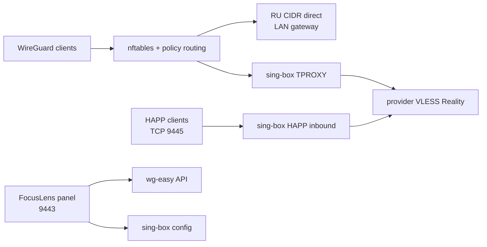

# FocusVPN

Единый VPN-шлюз и административная панель для WireGuard, sing-box и HAPP.

Состояние проекта зафиксировано: **2026-09-29**.

## Что готово

- sing-box 1.14.2 установлен на Ubuntu 22.04 LTS.
- Исходящий VLESS Reality с автоматическим выбором профилей и ручным selector в панели.
- TPROXY применяется только к клиентам WireGuard из `<wireguard-client-network>`.
- Российские IPv4 из агрегированного `ru.zone` обходят VLESS напрямую через LAN-маршрут.
- Частные сети и `<lan-network>` остаются direct.
- Добавлен ежедневный updater RU-сетей через systemd timer.
- WireGuard/wg-easy объединён с VLESS в одной FocusLens-панели и одной Basic Auth.
- Управление клиентами WireGuard: создание, включение, удаление, `.conf`, QR, live-активность и per-client запрет LAN.
- HAPP Direct routing-профиль для прямого выхода российских сервисов.
- Отдельный HAPP-compatible VLESS Reality server на TCP `9445`.
- HAPP Server использует provider VLESS outbound, а не прямой выход.
- SPA-навигация, общий shell, общий `panel.css`, CSP для локальных ресурсов и QR-модальные окна.
- Панель WireGuard показывает пять статусных карточек: онлайн, всего, DL/UL, WAN IP и uptime сервиса.

## Endpoints

| Назначение | Адрес |
|---|---|
| Админ-панель | `http://<gateway-host>:9443` |
| WireGuard UI | `http://<gateway-host>:9443/wireguard` |
| HAPP Direct | `http://<gateway-host>:9443/happ-routing` |
| HAPP Server | `http://<gateway-host>:9443/happ-server` |
| HAPP VLESS inbound | `<public-ip-or-domain>:9445` |

Панель разрешена из `<wireguard-client-network>`, `<lan-network>` и `<management-network>`. Порт `9445` требует внешнего TCP-проброса на `<gateway-host>:9445`, если сервер находится за NAT.

## Архитектура



## Репозиторий

- `server/panel/` — актуальный код FocusLens-панели.
- `server/panel/static/` — общий CSS, SPA-router, HAPP actions и favicon.
- `server/libexec/` — firewall, policy-routing и zone update scripts.
- `server/systemd/` — units и drop-in для автозапуска.
- `server/config/` — безопасные правила и обезличенные `.example` конфиги.
- `docs/OPERATIONS.md` — эксплуатация и деплой.
- `docs/PROJECT_STATUS.md` — закрытые вехи и текущий статус.
- `docs/ROADMAP.md` — следующие этапы.
- `docs/screenshots/` — обезличенные preview UI.
- `index.html` — публикационная страница проекта.

## Screenshots


## Важно по секретам

Реальные UUID, Reality public/private keys, Basic Auth hash, wg-easy API secret, VLESS-ссылки и SQLite базы намеренно не включены в git. В `server/config/` лежат только шаблоны с placeholders. Перед deploy нужно создать secret-файлы отдельно на сервере.

## Проверка перед публикацией

```powershell
Set-Location E:\_Project\VPN
python -m compileall server\panel
node --check server\panel\static\panel.js
node --check server\panel\static\happ-actions.js
git status --short
```

Публикация: [GitHub FocusVPN](https://github.com/DgekStr/FocusVPN), ветка `master`.
